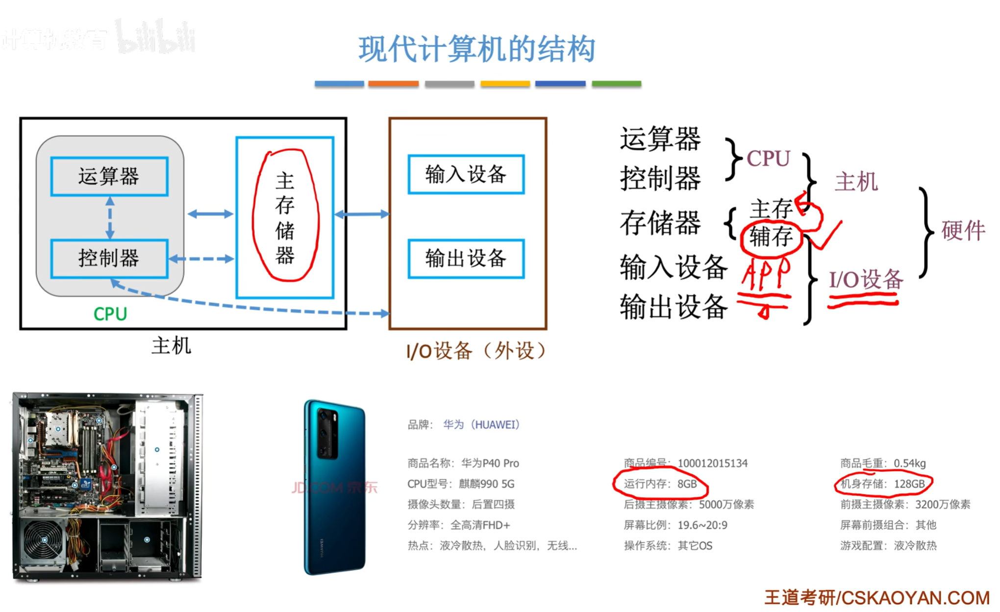
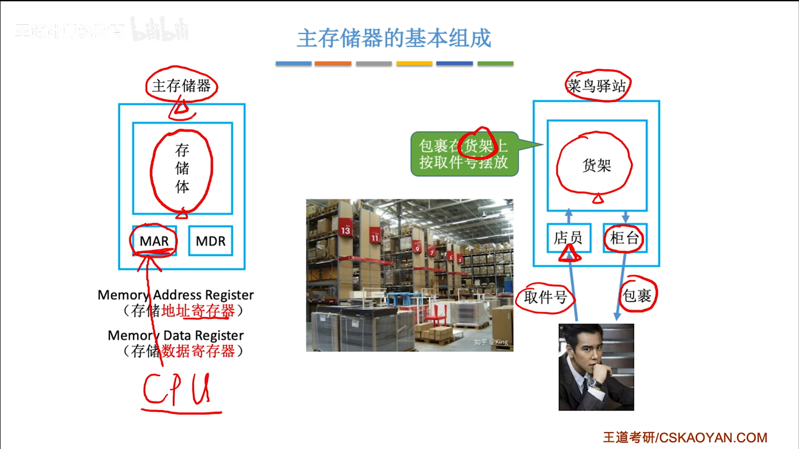
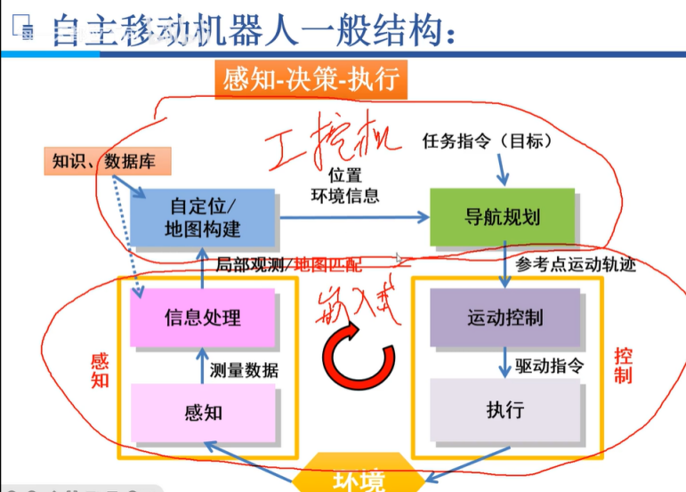
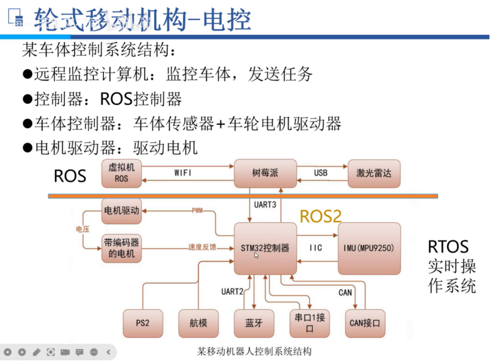

# 这是我的机器人工程师成长历程 #
插入前辈YY硕的指导 [机器人工程师学习计划](https://zhuanlan.zhihu.com/p/22266788) 

## 8.英语
Language is information,information is everything!

because I think it is very important!
## 1.艺术家—不止PPT 
### 1.1.PPT 
现有的AI工具还是不够智能，优秀的PPT只能靠在座的各位艺术家来亲自操刀来制作

### 1.2 Latex 
宇宙最强编辑器:VScode [Download](https://code.visualstudio.com/download)

[草履虫也能学会的Latex安装教程](https://zhuanlan.zhihu.com/p/166523064)

[教程 two](https://zhuanlan.zhihu.com/p/38178015)

在此，我对VScode的setting.json有了一些入门级理解了;

Latex比markdown难用一些，熟能生巧吧
### 1.3 markdown 
这是官方语法链接[Markdown](https://markdown.com.cn/basic-syntax/)

常写常新，熟能生巧

这里我想把超链接设置为新窗口打开，奈何官方现在好像不支持，

只好去文心一言查查了，一看好像涉及到HTML和JS的知识，

原来实现个小功能这么费劲，看得我热血沸腾，

一看文档官方支持内嵌HTML语法:于是尝试:

<a href="https://markdown.com.cn/basic-syntax/" target="_blank">NEW Markdown</a>

好像失败了，直接点击还是原来的效果

那么，暂时只能由各位阅读文档的小伙伴们右键单击在新窗口打开了;

**一些高级的语法功能还需要发挥想象力，创造需求，不断练习，熟能生巧**

### 1.4 好看的图图 

### 1.5 好用工具分享
截图大师
[Snipaste](https://zh.snipaste.com/)

矢量绘图
[inkscape](https://inkscape.org/)

VPN
[佛跳墙](https://ftq.369.cyou/#)

### 前端三剑客
#### HTML
#### CSS
#### JavaScript
[草履虫级别教程](https://www.bilibili.com/video/BV16a411U774/)

### QT开发（什么年代了还用MFC?）

## 2.单片机工程师 
### 2.1 单片机软件开发
#### STM32 
电机驱动
### 2.2 PCB设计
**实践操作**:贴片焊接、
**理论知识**:PCB设计原则、阻抗匹配、芯片手册
## 3.金工 
### SolidWorks
[学习路线](https://ifcski218x.feishu.cn/docx/WbhBdLwxYo06CUx4kCxcFTWbnyb)

[基本操作](https://www.bilibili.com/video/BV1iw411Z7HZ/?spm_id_from=333.999.0.0&vd_source=2922e33407c68c03ce52c8771580887c)

[机械臂](https://www.bilibili.com/cheese/play/ss865?csource=private_space_class_null&spm_id_from=333.999.0.0)
## 4.计算机相关
### 4.1 一些知识点
#### 4.1.1 详解makefile
> 原来我只是一只只会用IDE的蠢猪

命令：makefile  make 

工具：cmake   cmakelist.txt   cmake  makefile   make

预处理 编译 汇编 链接

.c到.o到.exe

动态库 静态库

touch用不了在Windows

最低版本 3.30.3

-v 和 --verison 有时不一样 

哈哈哈哈哈哈（markdown语法测试）

换行的关键在与Enter键

set命令设置   .cpp文件组合   cpp标准   生成文件的路径

搜索命令file aux

添加头文件路径

制作动态库、静态库

删除当前目录所有文件（包括文件夹）
：rm * -rf

动态库：lib + .so或者.dll

静态库：lib + .lib或者.a

如何发布项目
:头文件+静态/动态库文件

#### 4.1.2详解SSH
1、[常见加密算法与密钥对](https://zhuanlan.zhihu.com/p/347114235)

2、[RSA密钥](https://www.bilibili.com/video/BV1XP4y1A7Ui/?spm_id_from=333.788.recommend_more_video.0&vd_source=2922e33407c68c03ce52c8771580887c)

#### 4.1.3详解Docker

解决了环境搭建的问题，一个运维工具

模拟不同的环境，简化开发流程，缩短开发时间

docker和虚拟机的区别：

#### 4.1.4 网络配置相关

### 4.2 人工智能相关
#### 深度学习
训练集、验证集、测试集

区别：验证集和测试集：

关键在于有无反馈，类比和模考高考；

超参数调节

正规方程
### 4.3 基础四大件408
#### 计算机组成原理4.3.1

计算机如何识别0 1：高低电平->TTL电平、CMOS电平

exp:0100110011 ,每个“0”或“1”称为一个bit

**计算机系统 = 硬件 + 软件**

**软件 = 系统软件(操作系统、数据库管理系统、....) + 应用软件(VScode、...)**

逻辑元件：电子管->晶体管->中小集成电路->超大规模集成电路

名词：逻辑元件、操作系统、微处理器、机器字长、摩尔定律

**软件发展：**

机器语言->汇编语言->高级语言->C/C++、pythton、matlab、java

操作系统：Dos->Windows->ios、安卓、鸿蒙

#### 计算机组成原理4.3.2

硬件组成 = I/O设备、存储区、控制器、运算器、

指令 = 地址码 + 操作码

名词：存储程序

主存储器 = 存储体 + MAR + MDR

#### 操作系统
#### 计算机网络
#### 数据结构与算法
#### 编译原理
#### 语言学习:c/c++、python、matlab->simulink
### Linux->Ubuntu
### ROS
一种通信框架，本质并非操作系统，ROS用了很多**操作系统**和**网络底层技术**
[YY硕说ROS](https://www.zhihu.com/question/21958225/answer/20255931)
## 5.数学
[MIT牛人解说数学体系](https://www.douban.com/group/topic/11115261/?_i=57860257dDOFOz,74641787dDOFOz)

最起码需要血洗：高数、线代、

可以进一步学习：矩阵分析、泛函分析

有兴趣可以深入学习：

## 6.控制理论与实践
[在线仿真小球](https://pid-simulator-web.skythinker.top/)

## 7.机器人专业课
### 机器人的分类
操作机器人/机械臂:环境适应机器人,量身定制;

移动机器人:机器人适应环境,more感知智能;

#### 移动机器人
>齐次变换处于核心，但是可移动性改变了一切。
>
>轮式移动机器人基本的模型是有约束的非线性运动微分方程。
**轮式，足式，躯干仿生，混合式**
标准轮、脚轮、Swedish轮、球轮、履带
##### 性能指标
##### 研究内容
自主移动研究内容：我在哪、我要去哪、怎么去？

！！围绕--状态--开展

1定位、1地图构建、

2导航规划（运动学解算）、3执行控制（动力学解算）

